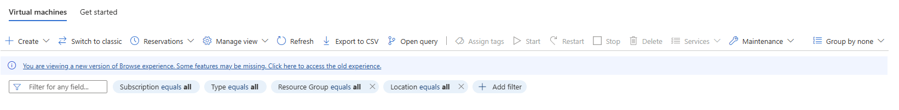
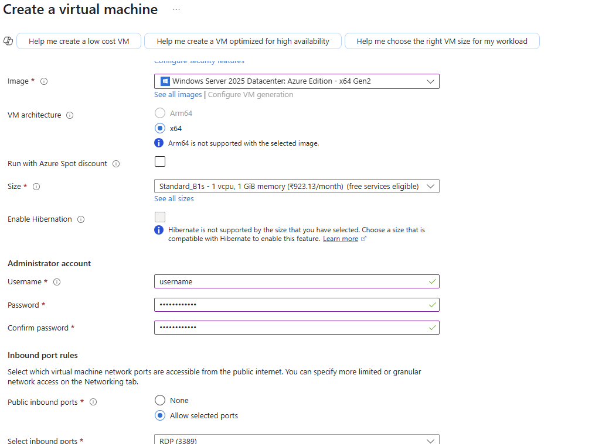

# Question 1
Deploy Linux and Windows virtual machine and access them using SSH and RDP

## Linux VM

## Steps:
1. Select virtual machines

2. Select create

3. Configure VM


4. Select SSH Key

5. We wont be needing further configurations so we select review and create


6. VM is now created

7. Now we open Terminal and execute the following command
    ```
    ssh -i "C:\Users\Arunabha\Downloads\arunabha_key.pem" azureuser@98.70.41.20

8.  We are now connected using ssh


## Windows VM
We will be following similar steps so go ahead and create another vm and select windows server as image this time.



## Steps:
1. Go ahead and create the vm as above.


2. After the vm is created click on connect and select download RDP file


3. Add password and you are now connected via rdp 
