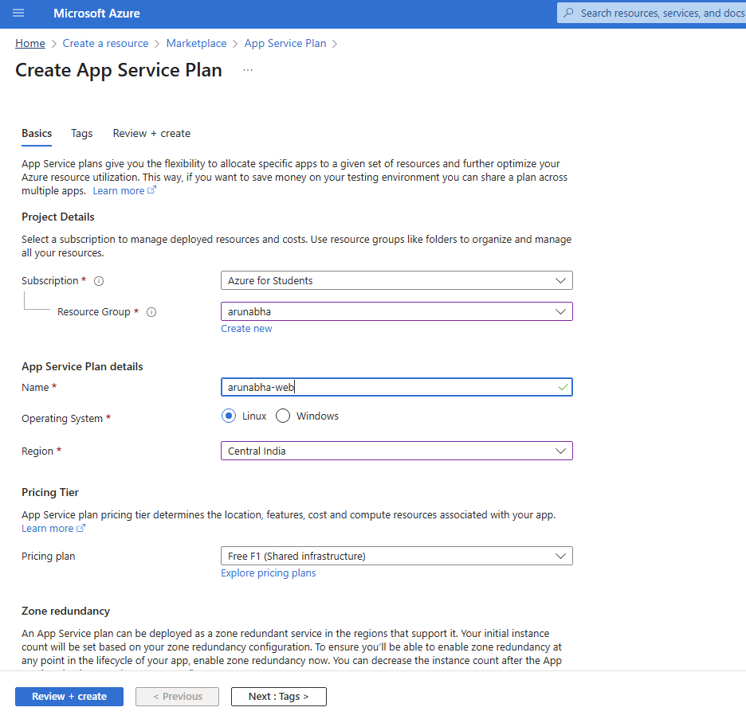
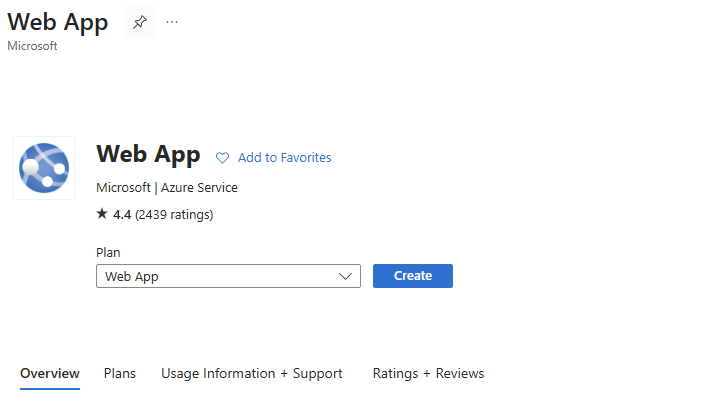
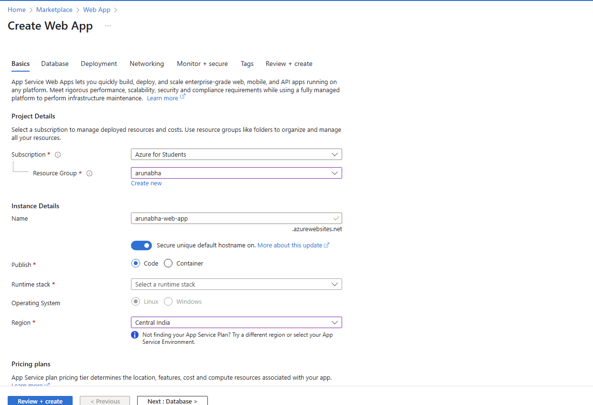
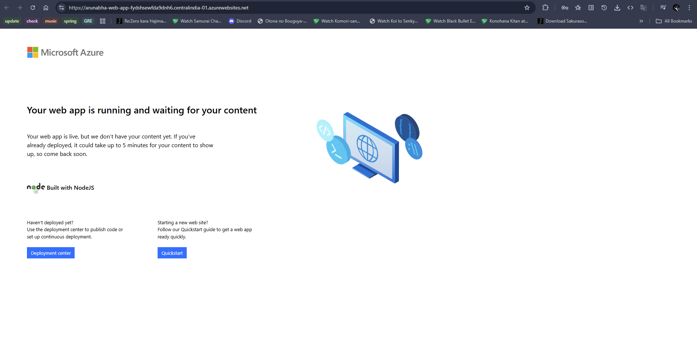

# Create an App Service Plan Provision a Web App in the existing App Service Plan and deploy a simple welcome page on it .

## Steps:
1. Go to create app service plan and fill in the configurations as the screenshot.

2. After creating a plan search web app and select

3. Configure web app (select runtime stack as node lts)

4. Go to resource and click on link the web app is deployed
