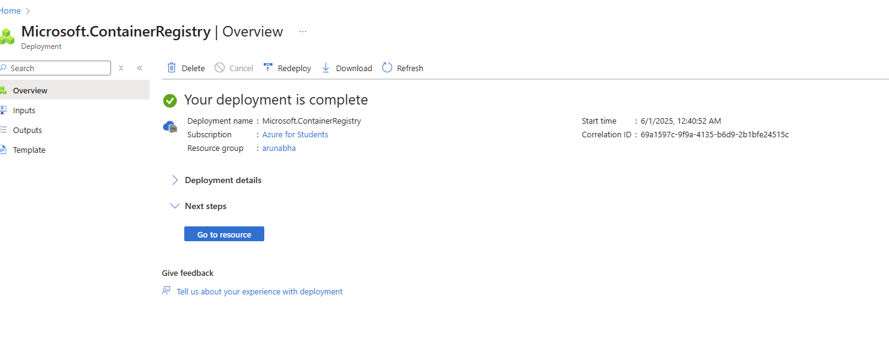
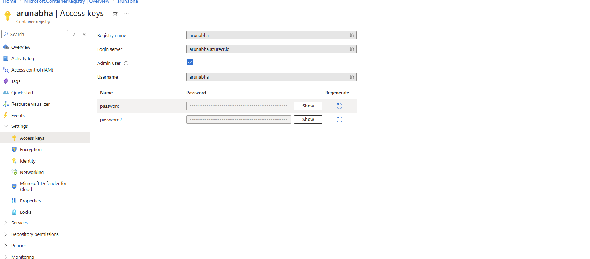
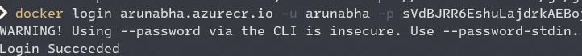
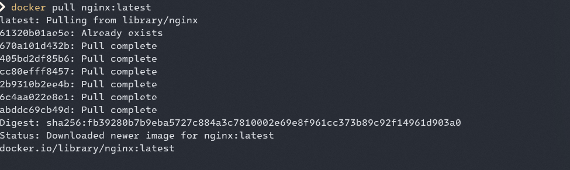
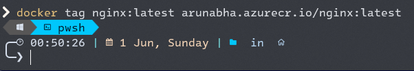
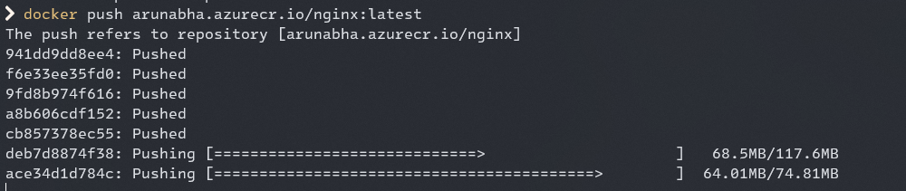
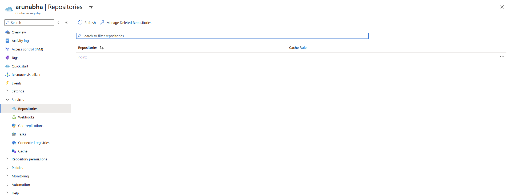
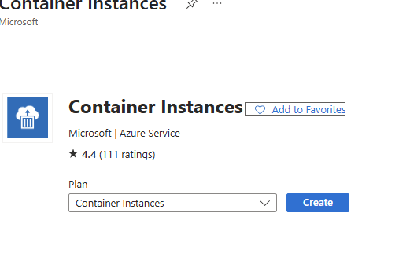
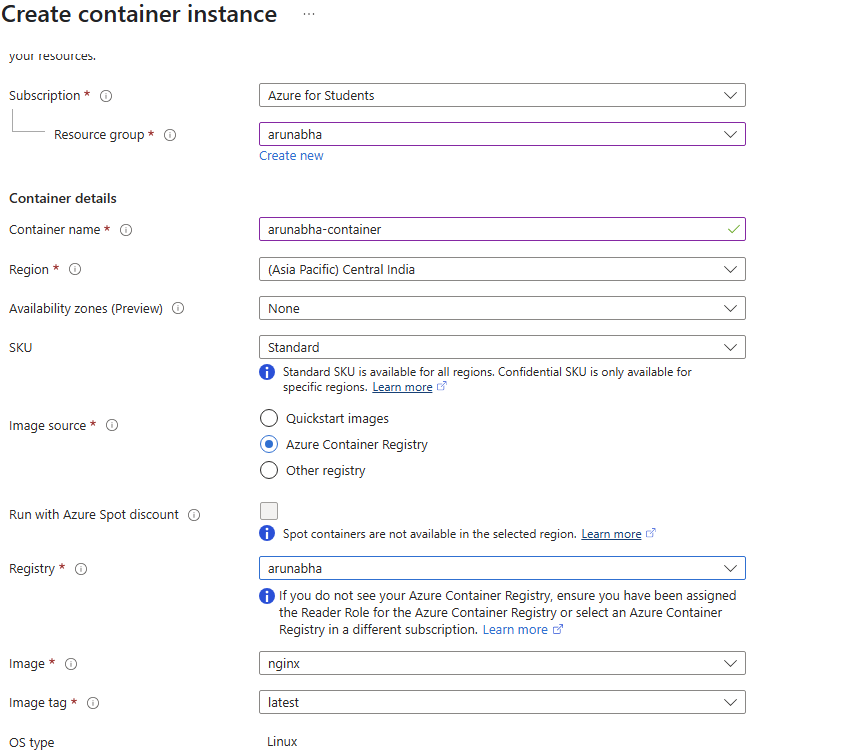
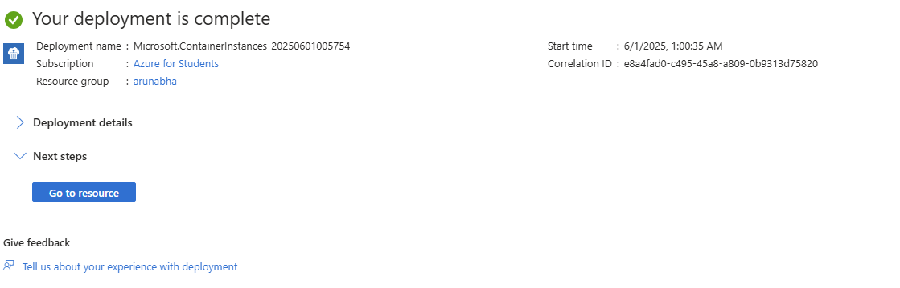

# Create ACR and pull image from ACR and Create a container from it

## Steps:
1. Go to container registry and create a container registry. 

2. Go to resource properties and note login server and then create access keys

3. Login to acr 

4. Lets pull a docker image

5. Tag the image for acr

6. Push image to acr

7. Verify Image in acr

8. Go to container instances and create a container instance 

9. Configure instance and select image from registry then select create

10. Container created
